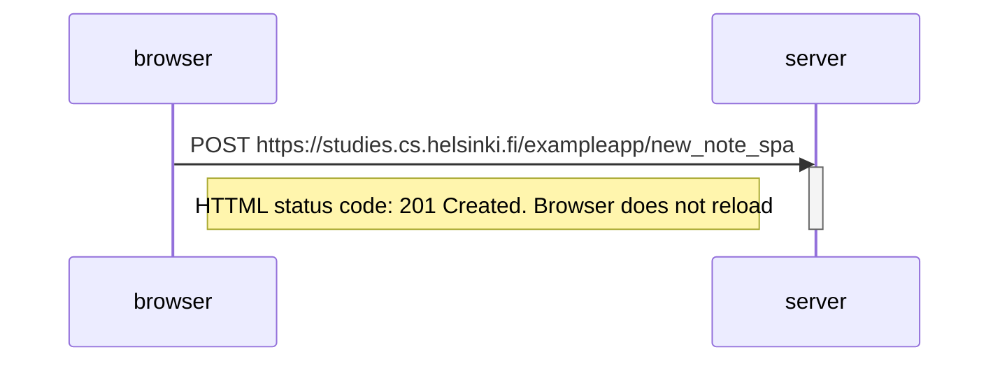

This is a sequence diagram for when the user creates a new note in SPA page

```mermaid
sequenceDiagram
    participant browser
    participant server

    browser->>server: POST https://studies.cs.helsinki.fi/exampleapp/new_note_spa
    activate server

    Note right of browser: HTTML status code: 201 Created. Browser does not reload
    deactivate server
```